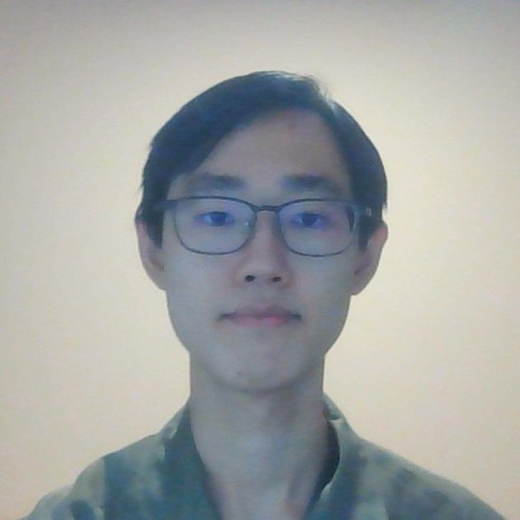
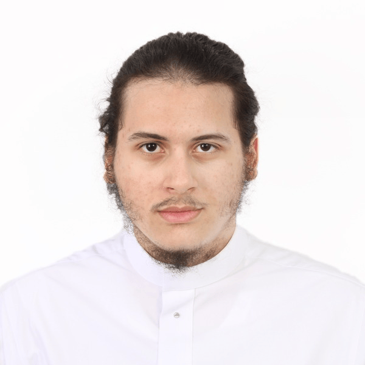
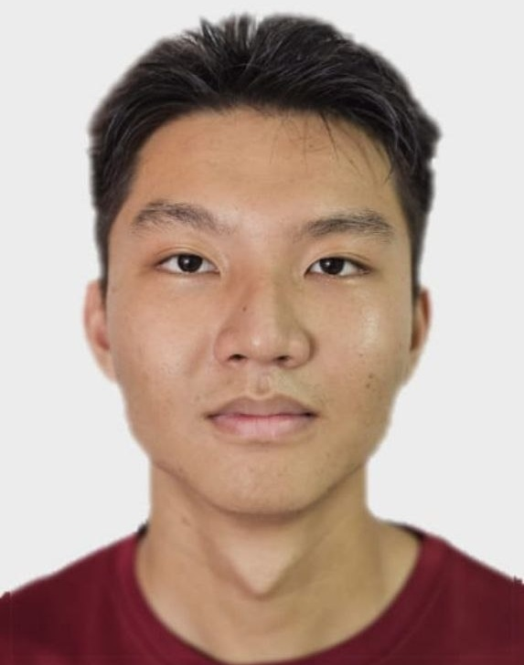

We are a team based in the [School of Computing, National University of Singapore](https://www.comp.nus.edu.sg).

You can reach us at the email `bakebase@comp.nus.edu.sg`

## Project team

### Yik Wee

[[homepage](https://yik-wee.github.io)]
[[github](https://github.com/yik-wee)]

* Role: Team Lead
* Responsibilities: Deliverables and Deadlines, Scheduling and Tracking

### Abdo

[[github](http://github.com/GODMODE899)]

* Role: Developer
* Responsibilities: Testing, Integration, Component Ingredients

### Kia Hao

[[homepage](https://neokh719.github.io)]
[[github](http://github.com/neokh719)]

* Role: Documenter and QC
* Responsibilities: Documentation, code quality

