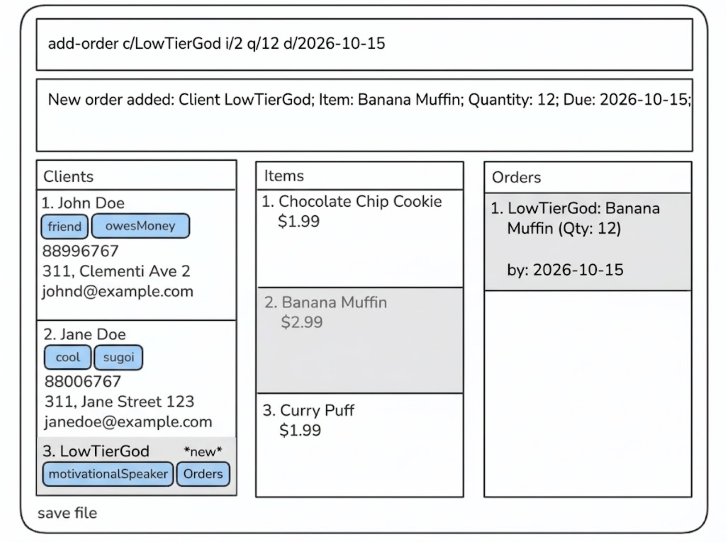

**BakeBase is a desktop application for home bakers running a home bakery business to manage their client contact and order details.** While it has a GUI, most of the user interactions happen using a CLI (Command Line Interface).

* If you are interested in using BakeBase, head over to the [_Quick Start_ section of the **User Guide**](UserGuide.html#quick-start).
* If you are interested in developing BakeBase, the [**Developer Guide**](DeveloperGuide.html) is a good place to start.

**Acknowledgements**

* Libraries used: [JavaFX](https://openjfx.io/), [Jackson](https://github.com/FasterXML/jackson), [JUnit5](https://github.com/junit-team/junit5)
